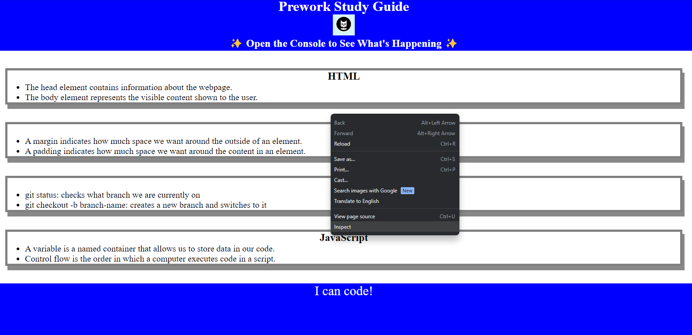
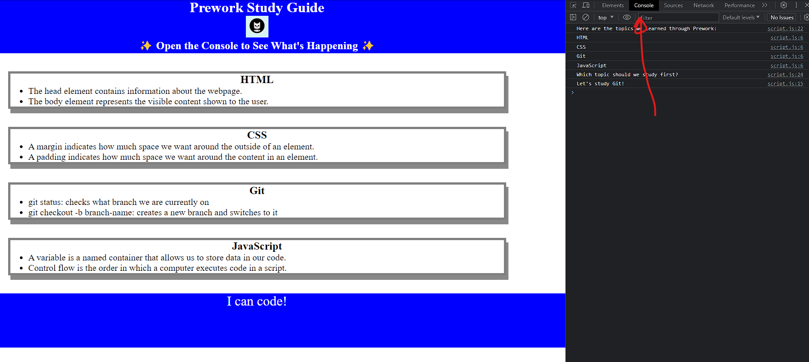

# Prework Study Guide for Students and the World

## Description

This project will serve as a repository for basic coding know-how and serve as a helpful study guide for myself and any other beginning coding students.

Given the vast amount of information we are likely to cover in the coding bootcamp, which serves as the impetus for this project, a unified compendium of terminology and tips may prove invaluable.

Additionally, this study project has been and will continue to be a focal point of learning, as well as a sandbox of sorts with which to practice my burgeoning coding skills.

## Installation

N/A

## Usage

The purpose of this Prework Study Guide is to provide notes on the four main topics covered in the University of Minnesota Coding Boot Camp Prework Lesson.

The notes contained therein cover terminology and tips for using HTML, CSS, Git, and JavaScript.

The DevTools console can be reached by right-clicking anywhere of the screen and selecting "Inspect" from the drop down menu.

Then, simply click the "Console" tab to view.

## Credits

N/A

## License

MIT License

Copyright (c) 2023 IvanDirigible

Permission is hereby granted, free of charge, to any person obtaining a copy
of this software and associated documentation files (the "Software"), to deal
in the Software without restriction, including without limitation the rights
to use, copy, modify, merge, publish, distribute, sublicense, and/or sell
copies of the Software, and to permit persons to whom the Software is
furnished to do so, subject to the following conditions:

The above copyright notice and this permission notice shall be included in all
copies or substantial portions of the Software.

THE SOFTWARE IS PROVIDED "AS IS", WITHOUT WARRANTY OF ANY KIND, EXPRESS OR
IMPLIED, INCLUDING BUT NOT LIMITED TO THE WARRANTIES OF MERCHANTABILITY,
FITNESS FOR A PARTICULAR PURPOSE AND NONINFRINGEMENT. IN NO EVENT SHALL THE
AUTHORS OR COPYRIGHT HOLDERS BE LIABLE FOR ANY CLAIM, DAMAGES OR OTHER
LIABILITY, WHETHER IN AN ACTION OF CONTRACT, TORT OR OTHERWISE, ARISING FROM,
OUT OF OR IN CONNECTION WITH THE SOFTWARE OR THE USE OR OTHER DEALINGS IN THE
SOFTWARE.